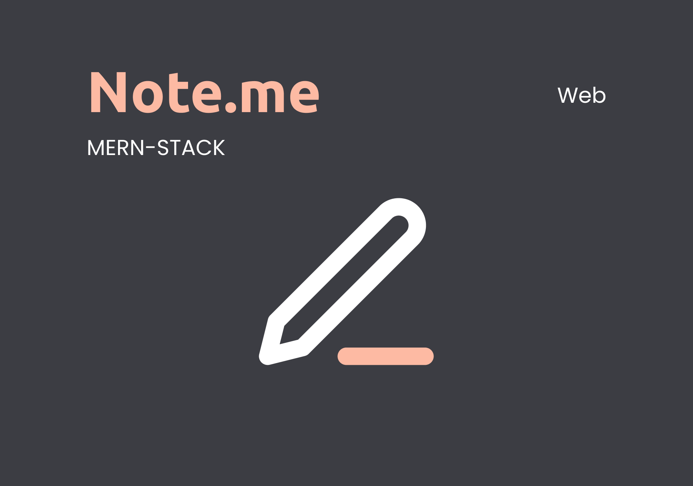
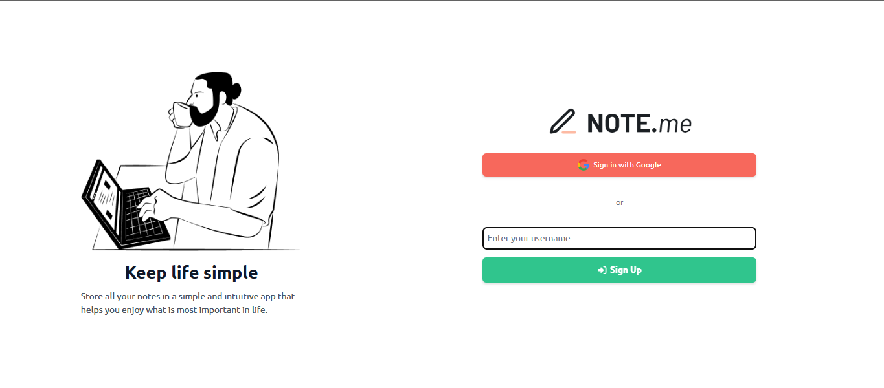
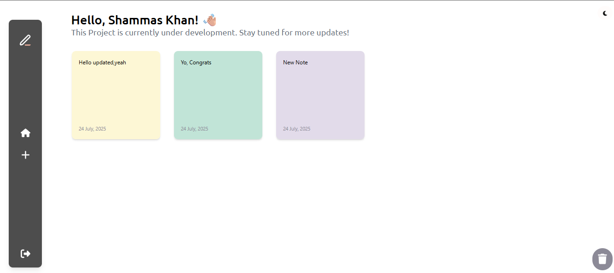
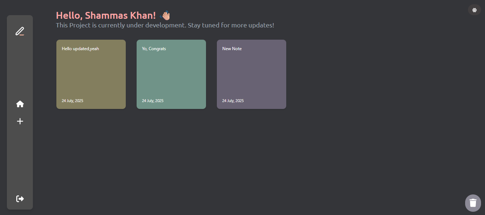
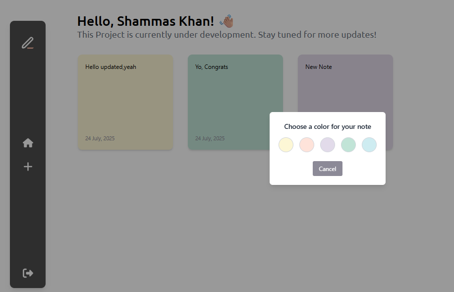

# Note.me



## Project Overview

**Note.me** is a modern note-taking web application built with the MERN stack. It features secure authentication, a beautiful UI with dark/light themes, and powerful note management capabilities.

---

## Tech Stack

- **Frontend:** React
- **Backend:** Node.js, Express
- **Database:** MongoDB
- **Authentication:** OAuth2 (Google Sign-In), JWT, Temporary Anonymous Sign-In

---

## Features

- **OAuth2 Authentication**
  - Google Sign-In
  - Temporary Anonymous Sign-In
- **JWT Auth** for secure API access
- **Dark and Light Theme** toggle
- **Main Home Page** with notes in both light and dark modes
- **Select Note Color** for personalization
- **CRUD Operations:** Create, Update, Delete notes

---

## Screenshots

### Login Page



### Home Page (Light Mode)



### Home Page (Dark Mode)



### Select Note Color



---

## Deployment

- **Frontend Live:** [https://shammaskhann.github.io/noteme/](https://shammaskhann.github.io/noteme/)
- **Backend GitHub:** [https://github.com/shammaskhann/Note.me-MERN-Stack/tree/master/Backend](https://github.com/shammaskhann/Note.me-MERN-Stack/tree/master/Backend)

---

## GitHub Repositories

- **Frontend Code:** [https://github.com/shammaskhann/Note.me-MERN-Stack/tree/master/Frontend](https://github.com/shammaskhann/Note.me-MERN-Stack/tree/master/Frontend)
- **Backend Code:** [https://github.com/shammaskhann/Note.me-MERN-Stack/tree/master/Backend](https://github.com/shammaskhann/Note.me-MERN-Stack/tree/master/Backend)

---

## API Endpoints

Below are the main API endpoints as defined in [`src/api.js`](Frontend/src/api.js):

```js
export const BASE_URL = "https://noteme-backend-5wni.onrender.com/";

export const API = {
  getUser: `${BASE_URL}/api/users/me`,
  googleAuth: `${BASE_URL}/api/users/google`,
  googleCallback: `${BASE_URL}/api/users/google/callback`,
  // Notes endpoints
  getNotes: `${BASE_URL}/api/notes`,
  getNote: (id) => `${BASE_URL}/api/notes/${id}`,
  createNote: `${BASE_URL}/api/notes`,
  updateNote: (id) => `${BASE_URL}/api/notes/${id}`,
  deleteNote: (id) => `${BASE_URL}/api/notes/${id}`,
};
```

---

## How to Run Locally

1. Clone the repo
2. Install dependencies in both `Frontend` and `Backend`
3. Set up your `.env` files as needed
4. Run backend and frontend servers
